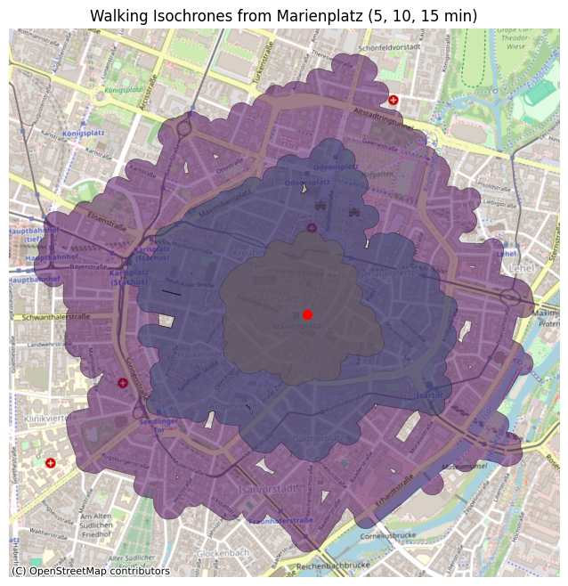

# Welcome to my Ted Talk 👋

---

> Motivated individual trying to make machines a bit more human by specializing in interacting with Large Language Models (LLMs), NLP, Software Development and various modern technologies.  

---

## 💻 About Me

- 👨‍💻 **Software Developer** focused on NLP and Large Language Model (LLM) applications  
- 🏢 _M.Sc. in Informatics_ from the **Technical University of Munich**
- 🐍 Fluent in Python, C++, and always happy to learn more!
- 🤖 Making machines a bit more human, one model at a time
- 📚 Sci-fi & fantasy bookworm ([Goodreads](https://www.goodreads.com/user/show/13025254-farhan-abid-ivan))
- 🧑‍🔬 Always tinkering with new projects in NLP, embeddings, and AI

---

## 🚀 Highlighted Projects

- # [🤖 FinTech Agent Engine: Autonomous Quant Backtesting Pipeline](https://github.com/faivan95/Fintech-Agent-Engine)

An autonomous, containerized multi-agent AI system that ideates, codes, self-heals, and executes quantitative trading strategies via Python and Pandas. Powered by local LLMs and LangGraph state orchestration.

---

### 🎥 Live Execution Demo

https://github.com/user-attachments/assets/272b8e8d-1c04-462f-9f52-8996c0e84959

- **[Munich_Walking_Isochrones](https://github.com/faivan95/Walking-Isochrones):**  
  Geospatial Data project that shows the reachable walking zones from the center of Marienplatz in Munich.  
  

    
  

  
  Language: Python

- **[RAG Pipeline](https://github.com/faivan95/RAG-Pipeline):**  
  Retrieval-Augmented Generation (RAG) using indexed documents in order to evaluate input text with Deepseek-R1 8B Model.  
  Language: Python

- **[Topic_Modeling_Pythia](https://github.com/faivan95/Topic-Modeling-Pythia):**  
  Topic modeling in Python using embeddings from various checkpoints of GPT-NeoX LLM training.  
  Language: Python

- **[Matrix_Template_Cpp](https://github.com/faivan95/Matrix_Template_Cpp):**  
  A C++ program for matrix operations, supporting both strings and numbers via templates.  
  Language: C++

*...and more on my [GitHub](https://github.com/faivan95?tab=repositories)!*

---

## 📫 Let's Connect

- [LinkedIn](http://www.linkedin.com/in/farhan-abid-ivan)
- [Medium](https://medium.com/@faivan)
- [Goodreads](https://www.goodreads.com/user/show/13025254-farhan-abid-ivan)
- **Email:** faivan95@outlook.com

---

## ⚡ Fun Facts

- :eye_speech_bubble: Always on the lookout for a good bargain
- ☕ Runs on memes, curiosity, and plot twists
- 🤓 Can usually be found reading or building the next LLM-powered thing

---

---

_Thanks for stopping by! May your models converge and your books have happy endings!_
